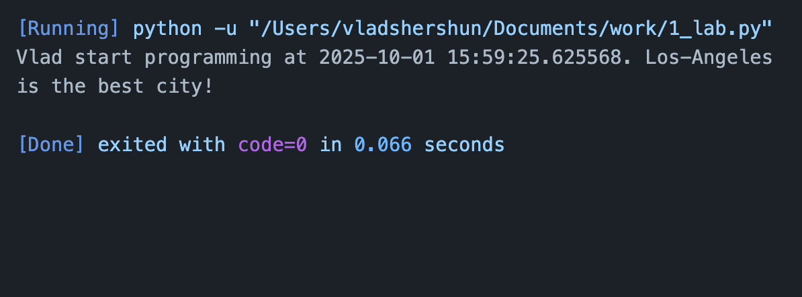
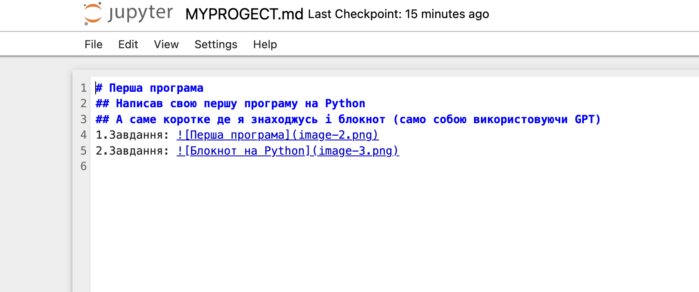

# Тема: Оформлення робіт та перша програма
# Мета: Написати свой перші програми на Python
# Перша програма
## Написав свою першу програму на Python 
## А саме коротке де я знаходжусь і блокнот (само собою використовуючи GPT)
## 1.Завдання: 
## 2.Завдання: 
## 3.Завдання: 
# Висновок:   

# Написані дві програми на Python, перша програма ознайомча в другій робили блокнот з використанням ШІ
# Мета робот досягнута
# Саме базове розуміння роботи Python
# Вдалося відповісти на всі заданні питання
# Всі заданні завдання вдалося виконати
  