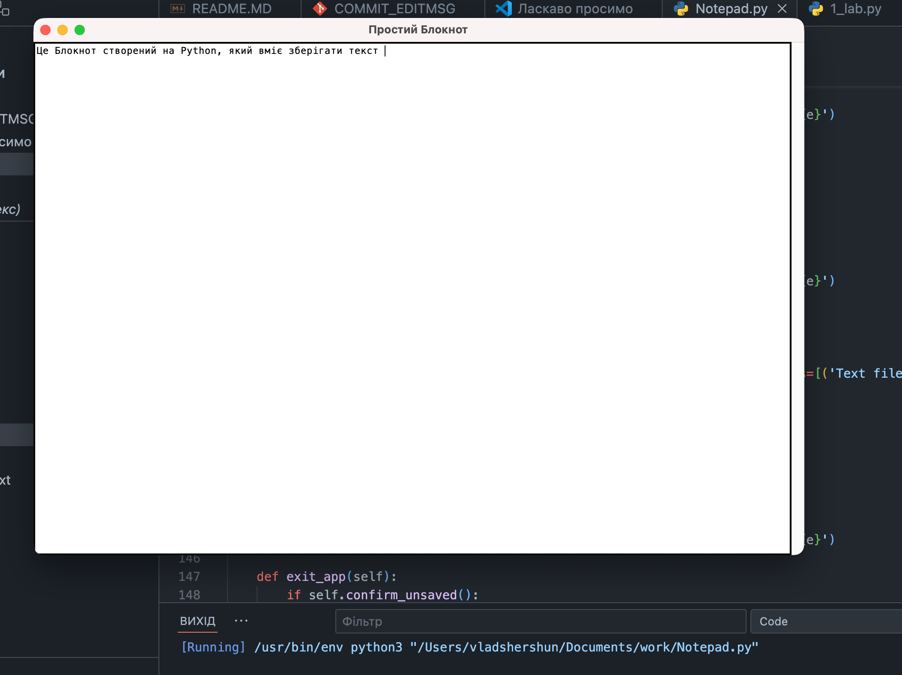

# Тема: Оформлення робіт та перша програма
# Мета: Написати свой перші програми на Python
# Перша програма
## Написав свою першу програму на Python 
## А саме коротке де я знаходжусь і блокнот (само собою використовуючи GPT)
## 1.Завдання: 
## 2.Завдання: 
## 3.Завдання: 
# Висновок: 

# Написані дві програми на Python
# Так мета робот досягнута
# Саме базове розуміння роботи Python
# Так удалося відповісти на всі заданні питання
# Так всі завдання вдалося виконати
