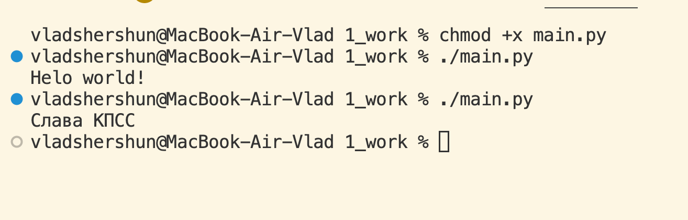

# Звіт до роботи
## Тема: Вчимось працювати з GitHub і Vscode
### Мета роботи: Навчитись працювати в середовищі GitHub і Vscode

---
### Виконання роботи
* Результати виконання завдання *1...N*;
    Отримали результат: 
* вставлені рисунки (скріншоти екрана або фотографії виконаного завдання у зошиті);

* з використанням URL 
    
* через локальні шляхи 

* 
    ```python
    def simple_function_example():
        pass
    ```

---
### Висновок:
> у висновку потрібно відповісти на запитання:

- :question: Що зроблено в роботі; 
## 1.Навчились працювати з Python, робити замітки, вставляти фотографій 
- :question: Чи досягнуто мети роботи;
## 2.Так досягли заданой мети, з першого пункта
- :question: Які нові знання отримано;
## 3.В першому пунтку перечислені
- :question: Чи вдалось відповісти на всі питання задані в ході роботи;
## 4.Так 


---