# Звіт до роботи 
## Тема: Знайомство з ООП
### Мета: Навчитись використовувати основні принципи ООП, розглянути кострукції побудови класу та створення обєктів та навчитись працювати з ними

## Виконання роботи

### Завдання №1: "Вкажіть у звіті що вивела пограма або зробіть скріншот та вставте у звіт"

### Завдання №2: Чому коли передаємо значення None створюється обєкт з іменем Anonymous?
### У конструкторі є логіка: якщо name дорівнює None, то замість нього береться анонімний користувач з ім’ям "Anonymous". Тобто None для нашого класу означає: “імені нема, підстав аноніма”

### Завдання №3: Як змінити текст привітання при виклику методу say_hello()?
## Метод say_hello уже влаштований так, що він бере текст привітання з параметра тому все, що треба зробити - при виклику методу передати свій текст замість стандартного.
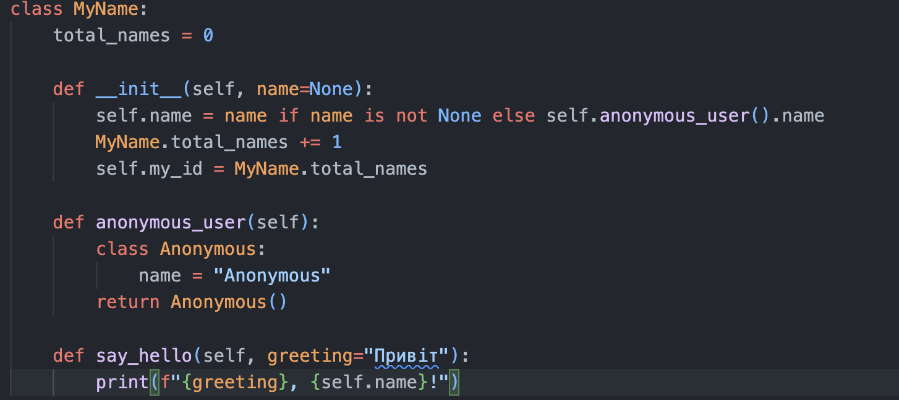

### Завдання №4: Допишіть функцію в класі яка порахує кількість букв імені (підказка: використайте функцію len()
## 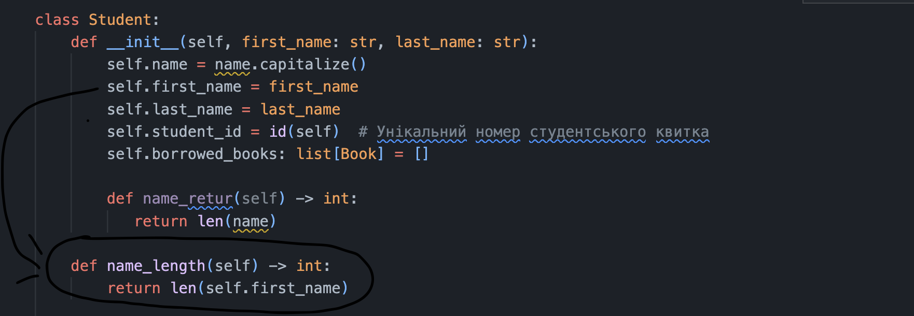
## Виводим результат:
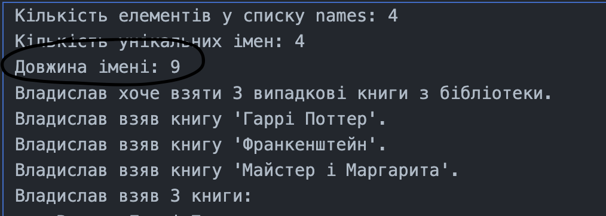

### Завдання №5: Порахуйте кількість імен у списку names та порівняйте із виведеним результатом. Дайте відповідь чому маємо різну кількість імен?
### Програма показує, що створено 4 “імені”. Це тому, що коли в список передається None, конструктор викликає метод anonymous_user Цей метод створює додатковий об’єкт з ім’ям Anonymous і при його створенні лічильник total_names теж збільшується. Потім створюється ще один об’єкт для None, якому вже підставляється ім’я Anonymous
### Але я ще попробував погратись з names
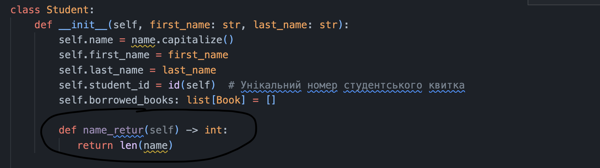
### Використовуємо імʼя і називаємо функцію
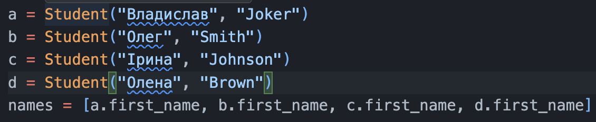
### Результат:
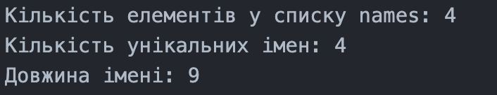

### Завдання №6: Модифікуйте конструктор init, щоб значення self.name завжди починалося з великої літери, навіть якщо користувач ввів маленьку.;
## 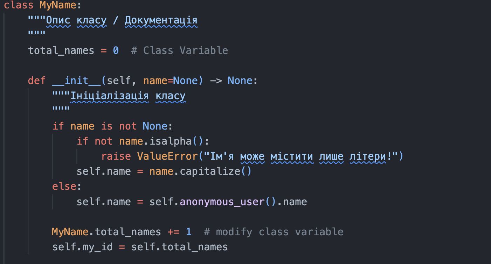

### Завдання №7: Змініть метод create_email так щоб можна було модифікувати значення після @;
### 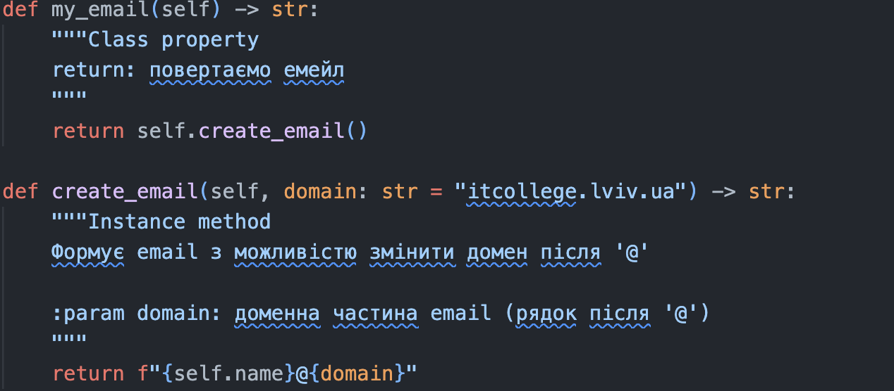

### Завдання 8: Додайте перевірку: якщо ім’я містить цифри або символи, підніміть помилку
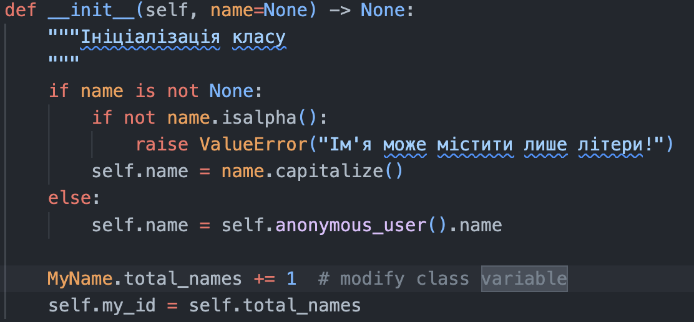

### Завдання 9: додайте нову властивість full_name, яка повертає результат у форматі: "User #<id>: <name> (<email>)"
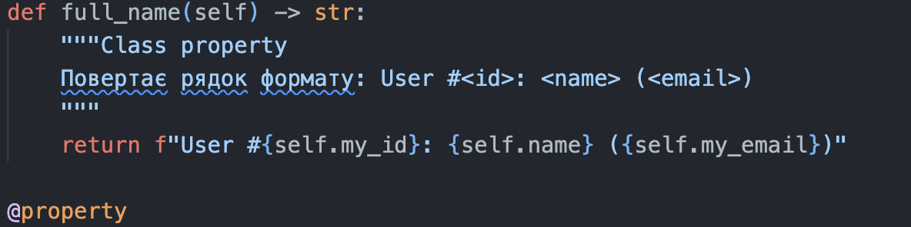

### Завдання 10: реалізуйте метод save_to_file(filename="users.txt"), який додає рядок із записом у файл;
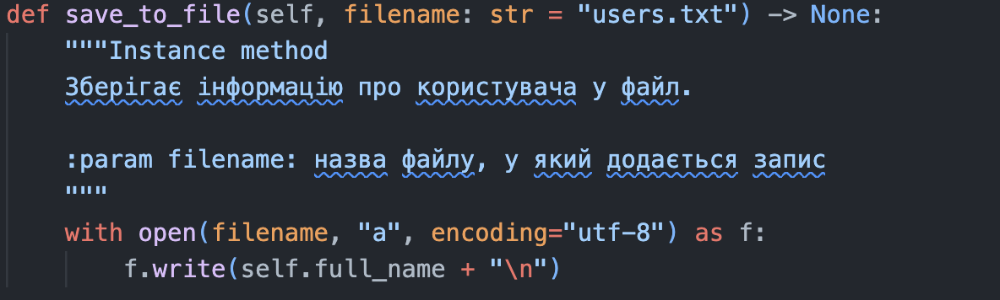

## Висновок: Я навчився працювати з функцією len рахуючи кількість букв в імені, поекспериментувати рахуючи скільки яка в нас є кількість імен в списку модифікував метод create_email так щоб можна було модифікувати значення після @, навчився додавати  перевірку, щоб в потрібному місці використовувались лише потрібні мені символи, навчився реалізуйте метод save_to_file(filename="users.txt"), який додає рядок із записом у файл 
## Чи вдалося досягнути заданой мети: Так
## Чи були завдання які не вдалося виконати: Ні
## Чи все було зрозуміло: Так
## PS: Якщо в написаному звіті будуть граматичні помилки то вибачайте, поміняв розкладу на клавіатурі 
