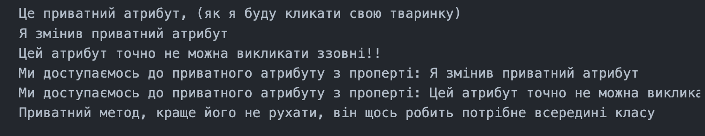
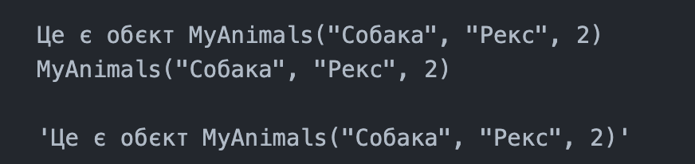
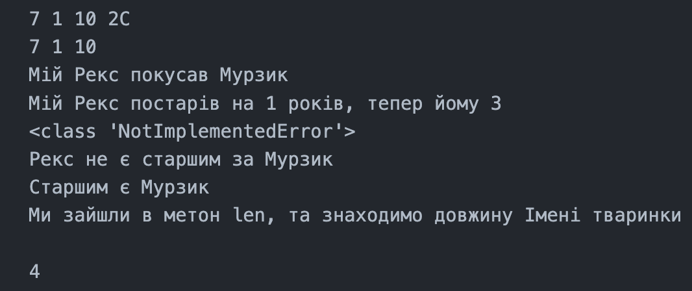

# Звіт до роботи 
# Тема: Програмування з використанням ООП
## Мета роботи: Навчитись працювати з Класами та його основними конструкціями
## Виконання роботи:
## Завдання 1
## Виводим тип створеного обʼєкта  

## Завдання 2
## Перейменував всі обєкти a1-a3 та вивів їх 

## Завдання 3
## Застосував методи класу до всіх обєктів a1-a3

## Завдання 4
## Задав декілька обєктів в циклі та вивів глобальну змінну

## Завдання 5
## Викликав статичний метод для кожного обєкта a1-a2

## Завдання 6
## Вивів ще одну properties та вивів її

## Завдання 7
## Дописав метод класу який буде превіряти що атрибут name заданий з великої букви

## Завдання 8 
# Приватні атрибути та методи

## Завдання 9
# Магічні методи

## Завдання 10
# Арифметичні методи

# Висновок 
## Що зроблено в роботі?
### Від створення базового класу до Глобальною змінною над всіма обєктами, Роботою з properties, Статичні методи та змінна self
## Чи досягнуто мети роботи?
### Так досягли! 
## Які нові знання отримано?
### Навчився працювати з properties, Статичними методами та зміною self та закріпив роботу з Застосування методу класу, порівняння з простими методами каласу 
## Чи вдалось відповісти на всі питання задані в ході роботи?
### Так вдалося! 
## Чи вдалося виконати всі завдання?
### Так вдалося! 
