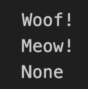
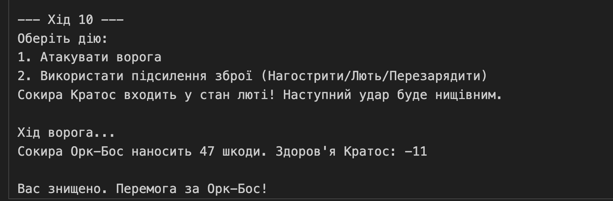

# Звіт до роботи
## Тема: Основні парадигми ООП
## Мета: Ознайомитись з ключовими поняттями об’єктно-орієнтованого програмування (ООП) у Python та навчитися реалізовувати їх у власних класах на прикладі ігрової симуляції.
## Виконання Завданнь:
### 1. Інкапсуляція (Додайте генератор випадкових чисел та викличіть методи deposit та withdraw у циклі передаючи випадкові числа. Виведіть кінцевий результат)

### 2. Наслідування (створіть ще один метод у класі Vehicle та викличіть його з обєкта класу Car;)

### 3. Поліморфізм (створіть клас Fish у якого небуде метода speak. Як буде поводити себе обєкт класу Fish при виклику методу speak?)

### 4. Використання парадигм для створення простої гри (Додайте третій тип зброї — Bow (лук), який: має власний параметр range_power (дальність); метод attack() з формулою шкоди attack_power + randint(5, 15) + range_power; має метод reload(), який збільшує дальність (range_power += 1); Додайте випадковий вибір зброї з трьох можливих (Sword, Axe, Bow);Зробіть гру покроковою, де користувач може робити хід та вибирати дії з своїм типом зброї (наприклад, атакувати або накласти підсилення щоб підвищити ефективність зброї на наступному кроці);)

## Висновок

### Що зроблено в роботі?
- Розібрали роботу Інкапсуляції, Наслідування, Поліморфізм, Використання парадигм для створення простої гри

### Чи досягли мету?
- Так

### Які нові знання отримали?
- Ознайомився з ключовими поняттями об’єктно-орієнтованого програмування (ООП) у Python та навчився реалізовувати їх у власних класах на прикладі ігрової симуляції
