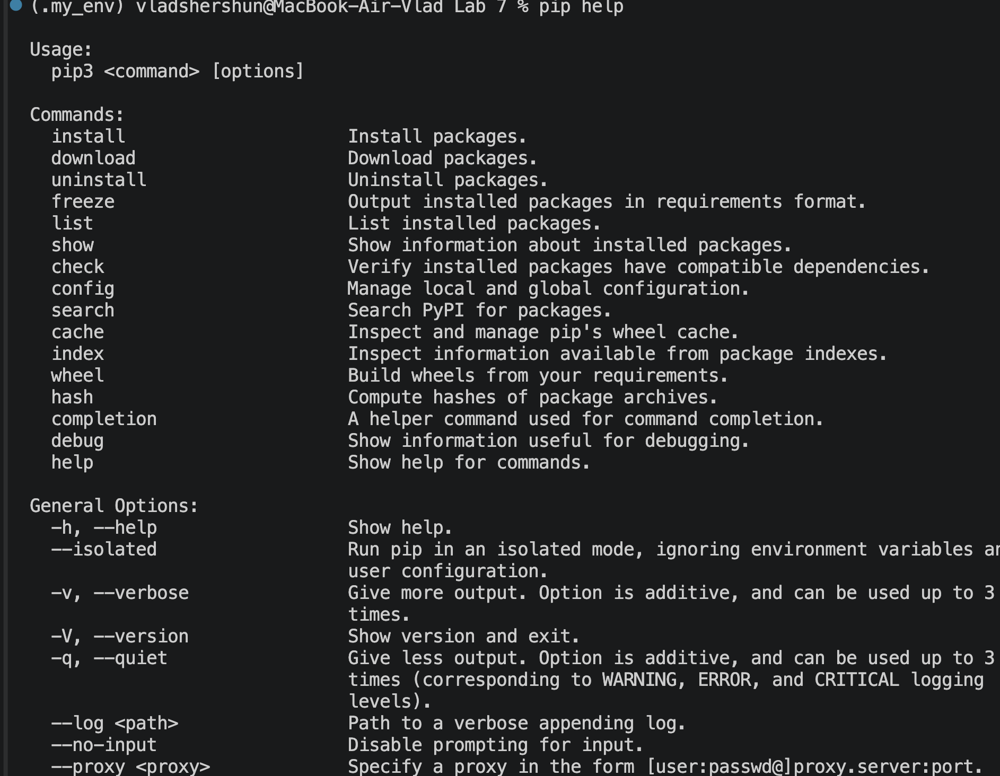

# Звіт до робити 
## Тема: Віртуальні середовища
### Мета роботи:
- Ознайомитися з віртуальними середовищами Python
- Навчитися створювати та використовувати віртуальні середовища
### Хід роботи:
## Основи роботи з сторонніми бібліотеками
### Дії які можна робити завдяки pip 
### Встановили reuest бібліотеку за допомогою pip
### Виконали команду pip show requests 
## Робота у віртуальному середовищі
### Створили VENV та його активували 
### Створили файл .gitignore і додали туди наступні файли/папки: .my_env /Pipfile /Pipfile.lock
## Робота з pipenv
### Команди які можна виконувати через pipenv 
### Створили файл Pipfile і Pipfile.lock в них зберігаються всі нам потрібні налаштування для подальшої роботи
### Використали бібліотеку rich 
### Поміняли Інтерпритатор Python і запустили прошлий код, він видав помилку бо не має потрібної бібліотеки 
### Почали працювати з бібліотекою flake8 і зробили перевірку коду(всі помилки виправили) 
### Також зробили сканування всіх можливих вразливостей 
## Робота зі змінними середовища
### Якщо виконати скріпт без віртуального середовища то буде помилка
## Робота з Poetry
### Виконали різні команди пакету Poetry
### Створили програму для цього проекту та запустили у віртуальному середовищі 
# Висновок: 
## Що зроблено в роботі
### У роботі створено віртуальні середовища Python за допомогою venv, pipenv та poetry. Встановлено сторонні пакети, проведено перевірку коду через flake8 та аудит безпеки. Налаштовано роботу зі змінними середовища через файл .env. Створено та запущено веб-сервер на Flask, який отримує дані з API та виводить їх на веб-сторінку
## Чи досягли мети
### Так
## Які нові знання отримали?
### Отримано практичні навички створення та управління ізольованими середовищами Python (venv, pipenv, poetry). Засвоєно методи управління залежностями, аудиту безпеки та перевірки якості коду. Вивчено принципи конфігурації проєктів через .env файли. Опановано базові концепції розробки веб-серверів на Flask та виконання запитів до зовнішніх API